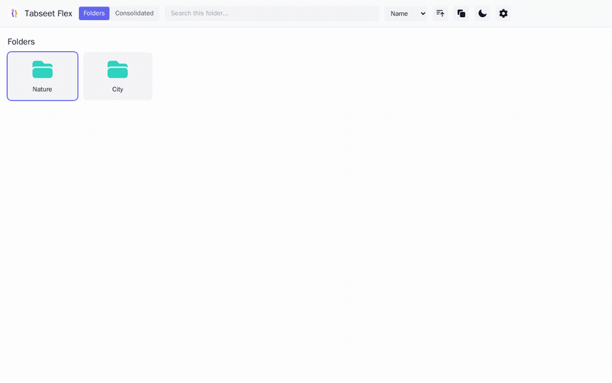
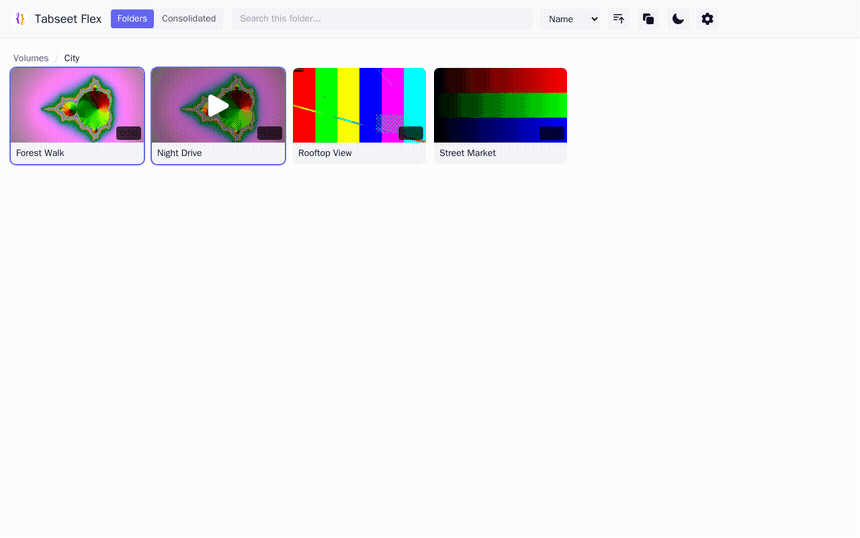
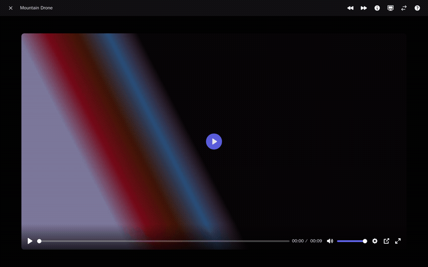
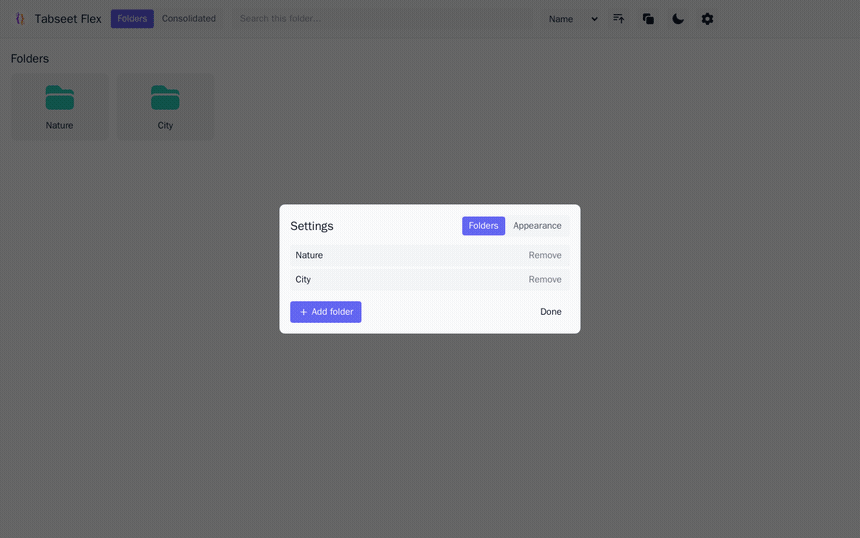
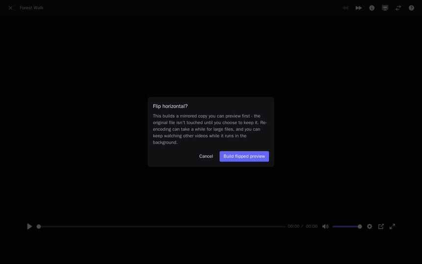
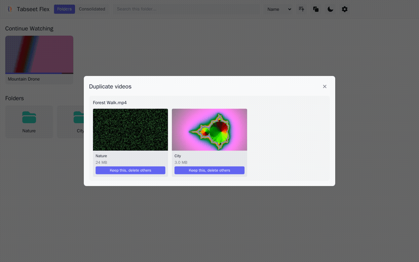

# Tabseet Flex

A personal, local-only media library and video player. Runs entirely in
Docker - nothing is installed on your machine, and nothing is deployed
anywhere. Works on macOS, Linux, and Windows (via WSL2 - see
[Windows](#windows-wsl2) below).



## Features

**Browse folders, search, and sort.** Library folders show up as cards on
the home screen; opening one lists its videos with poster thumbnails,
duration, and file size. Search filters by filename within the current
folder (or across the whole library from the Consolidated tab), and
results sort by name, date, duration, or size.



**One view across every drive.** The Consolidated tab flattens every
library folder - across every mounted drive - into a single searchable
grid, so you don't have to remember which volume something lives on.


**A custom player built for keyboard/trackpad control.** [Plyr](https://plyr.io)
under the hood, with a full keyboard-shortcut layer on top (seek, volume,
speed, theater mode, PiP, frame-accurate jumps) - see
[Player shortcuts](#player-shortcuts) below - plus two-finger trackpad
gestures on macOS and a Continue Watching row that picks up where you left
off.



**Light/dark mode and twelve accent color presets.** Pick a palette in
Settings → Appearance; it's just CSS variables, applied instantly, no
reload.



**Flip a video without touching the original.** Builds a mirrored preview
copy first - decide whether to keep it (atomically replacing the original)
or discard it, all without leaving the player. See
[Flipping videos](#flipping-videos) below for the full workflow.



**Find and clean up duplicates.** Scans every library folder for videos
that share a name and lets you pick which copy to keep - thumbnails
included, so you can tell them apart before deleting anything.



## Stack

- **Backend**: Node.js + Express. Streams video with HTTP Range support,
  generates thumbnails on demand via `ffmpeg`/`ffprobe`.
- **Frontend**: Vite + React + Tailwind CSS.
- **Player**: [Plyr](https://plyr.io) (open source, MIT) with a custom
  keyboard-shortcut layer.
- **Docker backend**: on macOS, [Colima](https://github.com/abiosoft/colima)
  running in its own dedicated VM profile (`tabseet-flex`) - macOS has no
  native container runtime, and the dedicated profile means it never
  touches or restarts whatever else you have running under your normal
  `default` Docker context. On Linux (and WSL2, a real Linux kernel),
  there's no VM involved at all - `start.sh`/`stop.sh` talk straight to
  the system's native Docker daemon.

## Running it

First time only - `mounts.txt` is gitignored (it's specific to this
machine's drives), so create yours from the template:

```sh
cp mounts.txt.example mounts.txt
# then edit mounts.txt with your own drive paths
```

```sh
./start.sh
```

Then open **http://localhost:4400**. On macOS, first run also starts the
dedicated Colima VM if it isn't already running (not applicable on
Linux/WSL2 - there's no VM).

To stop it:

```sh
./stop.sh
```

This stops the container, and on macOS also stops the dedicated Colima VM,
freeing its RAM/CPU until next time.

The first run builds the Docker image (installs ffmpeg + npm deps inside the
container - takes a minute or two). Subsequent `./start.sh` runs are fast.

## Why a dedicated Colima VM (macOS only)

macOS has no native container runtime, so Docker has to run inside a Linux
VM. Colima (unlike Docker Desktop) only auto-shares your home directory
into that VM by default, and that default goes away the moment you pass
any `--mount` flag - it won't transparently expose a *separately mounted*
drive like `/Volumes/MyDrive` just because it's attached to the machine.
So on macOS, this app runs Colima in its own dedicated profile, with the
drives from `mounts.txt` (see below) and this project directory (for
`data/`/`cache/` persistence) explicitly shared. `start.sh`/`stop.sh`
handle this for you - you shouldn't need to run `colima` commands manually.

`start.sh` figures out which drive each entry in `mounts.txt` actually
lives on by asking the filesystem (`df -P`) rather than assuming a fixed
layout like `/Volumes/<name>`.

On Linux (and WSL2), none of this applies: there's no VM, so no separate
drive-sharing step at all - any path Docker can see on the host bind-mounts
directly, the same way `data/`/`cache/` already do in `docker-compose.yml`.

### Windows (WSL2)

There's no Docker Desktop dependency here, but Windows itself still has no
native container runtime, so run this app from inside
[WSL2](https://learn.microsoft.com/windows/wsl/install) (e.g. an Ubuntu
distro) with Docker Engine installed *inside* that distro - WSL2 is a real
Linux kernel, so at that point it's identical to the Linux case above: no
Colima, no VM-mount step, `start.sh`/`stop.sh` talk straight to the native
Docker daemon. Windows drives are reachable from WSL2 under
`/mnt/<drive-letter>/...` (e.g. `/mnt/d/Media`), which works in
`mounts.txt` like any other path.

## Adding/removing mounted folders

Which host folders are visible to the app is controlled by **`mounts.txt`**
- one path per line, add `:rw` for folders where you want the player's
flip feature to be able to replace the original file (everything else is
read-only):

```
/Volumes/MyDrive/Movies:rw
/Volumes/Backup/Shows:rw
```

After editing it, just run `./start.sh` again - it re-reads this file and
re-derives the Docker volumes, plus the Colima VM's shares on macOS (no
rebuild/VM-recreate needed *unless* you add a path on a drive Colima isn't
already sharing, in which case it'll start a fresh VM share for it
automatically). On Linux/WSL2 there's no VM step - the new path is just
bind-mounted directly.

There's no templating engine here (Jinja and friends are overkill for one
YAML list) - `start.sh` parses `mounts.txt` itself and pipes the resulting
`volumes:` overlay straight into `docker compose ... -f -` via stdin
(layered on top of the static `docker-compose.yml`), plus - on macOS - the
Colima `--mount` flags, computed in the same pass. Nothing is written to
disk, so there's no generated file to regenerate or clean up.

Folders listed in `mounts.txt` show up as library folders on first run
automatically (whichever of them are actually present). To add a folder
that *isn't* a drive root in `mounts.txt` (e.g. a specific subfolder), you
can also do it from the UI: open **Settings (⚙)** → **+ Add folder** and
browse to it - no restart needed, as long as it's under a drive that's
already shared.

## Branding

`web/public/favicon.svg` is used as the browser favicon and the header
icon.

## Data and cache

- `data/` - your configured library folders and watch progress (JSON files).
- `cache/` - generated poster thumbnails. Safe to delete; everything
  regenerates on demand.

Both are bind-mounted from the host so they survive container rebuilds.

## Player shortcuts

| Key | Action |
| --- | --- |
| Space / K | Play / pause |
| ←/→ or J/L | Seek 10s (+Shift for 1s) |
| ↑ / ↓ | Volume |
| M | Mute |
| F | Fullscreen |
| T | Theater mode |
| P | Picture-in-picture |
| , / . | Playback speed down/up |
| 0-9 | Jump to 0%-90% |
| [ / ] | Previous / next video in folder |
| H | Flip horizontal (builds a preview first - see below) |
| I | Toggle file info panel |
| Esc | Close player |

On macOS, two-finger trackpad swipes also work over the player: horizontal
to seek, vertical to adjust volume (a plain mouse wheel works for volume
too).

## Flipping videos

The flip button/shortcut builds a mirrored **copy** of the file (libx264,
crf 18 - a pixel flip can't be done without re-encoding) and lets you
preview it in the player before deciding anything. The original is only
ever touched if you click **Keep** (atomic rename over the original, so a
crash mid-flip can't half-overwrite it); **Discard** just deletes the
copy. Runs in the background - you can keep browsing/watching other videos
while it encodes, and a status bar (bottom-right) tracks it wherever you
are in the app, with the same Preview/Keep/Discard actions. Only works in
folders marked `:rw` in `mounts.txt` - elsewhere it'll fail with a clear
read-only error when you try to Keep.

## Notes

- Folder listings show videos directly inside that folder (not recursive).
  Search filters by filename within the current folder.
- The first time you open a folder with lots of unwatched videos, computing
  durations (via `ffprobe`) can take a little while; results are cached
  permanently in `data/meta.json` after that.
- Poster thumbnails (in the grid) are generated lazily, the first time
  they're actually requested, cached forever in `cache/`, and
  concurrency-limited (3 at a time, dropping to 1 automatically while any
  video is actively streaming) so scrolling a huge library can't spawn
  unbounded `ffmpeg` processes or starve active playback for I/O on a slow
  drive - the first cold scroll through a large library still takes a
  while (it's transcoding hundreds of videos), but everything else stays
  responsive while it works in the background, and it's instant after. Any
  poster job still mid-decode the moment a stream starts is paused
  (`SIGSTOP`) for as long as that stream is active, not just deprioritized,
  so it can't keep competing with playback for I/O on a slow drive.
- The container has a 2GB memory cap (`docker-compose.yml`) as a backstop
  so a runaway burst gets killed rather than taking down the VM. It's
  manual start/stop only (`restart: "no"`), so it never comes back on its
  own, not even after a crash or a Colima VM restart; run `./start.sh`
  again when you want it back.
